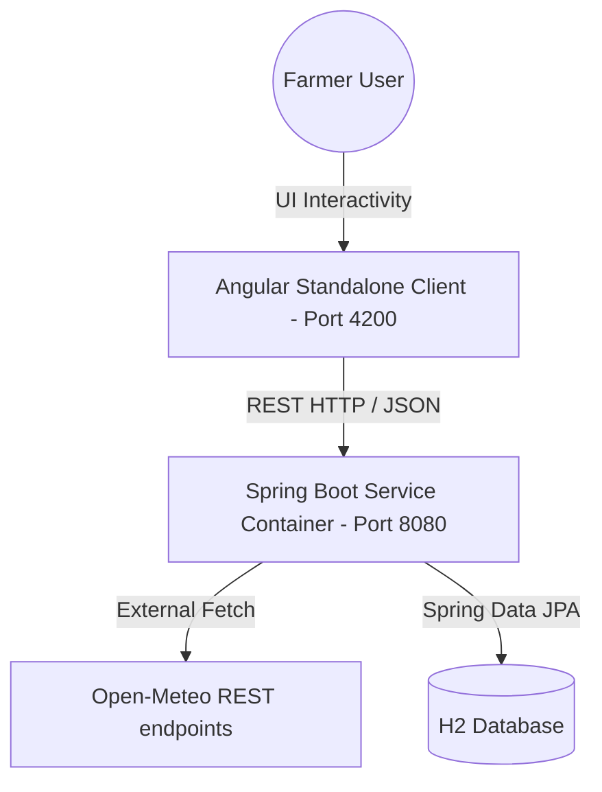

# FarmSetu Developer Documentation

Welcome to the FarmSetu developer documentation. This guide details the Decoupled Service architecture, component design patterns, database schemas, and key API interfaces.

---

## 🏛️ System Architecture

FarmSetu follows a standard decoupled Model-View-Controller (MVC) pattern across the stack:



* **Frontend**: Built using **Angular 18** with a standalone feature directory structure. Uses **Angular Signals** for reactive state updates and **RxJS** for network call bindings. Styled using **Tailwind CSS v3** and custom WebKit style sheets.
* **Backend**: **Spring Boot 3** running a multi-layered MVC service layout. Built with **Maven**, using **Lombok** annotations for clean boilerplate management, and **Jackson** annotation properties for controlling serialization.

---

## 📂 Project Directory Structure

```text
farmsetu-full-stack/
│
├── backend/
│   ├── src/main/java/com/farmsetu/
│   │   ├── config/          # CORS configurations & startup database seeders
│   │   ├── controller/      # REST Endpoints (Auth, Crops, Calendar, Mandi, Weather)
│   │   ├── exception/       # RestControllerAdvice Global Exception handlers
│   │   ├── model/
│   │   │   ├── dto/         # Request payloads, login credentials, & ApiResponse wrappers
│   │   │   └── entity/      # JPA Hibernate entities (User, Crop, Farm, CalendarTask)
│   │   ├── repository/      # Spring Data JPA interfaces
│   │   └── service/         # Transactional business logic & REST API call wrappers
│   └── pom.xml              # Maven dependencies build script
│
└── frontend/
    ├── src/app/
    │   ├── core/            # Services, models, guards, & error interceptors
    │   ├── features/        # Standalone components (dashboard, calendar, market, weather)
    │   └── shared/          # Navigation side-bar layouts & header components
    ├── tailwind.config.js   # Tailwind theme variables definition
    └── package.json         # Node build actions & dependencies
```

---

## 🖥️ Feature Component Details

### 1. Geospatial Farm Dashboard (`/app/farm-dashboard`)
* **Component Files**: 
  - [`farm-dashboard.component.ts`](file:///d:/new%20project%20f/frontend/src/app/features/farm-dashboard/farm-dashboard.component.ts)
  - [`farm-dashboard.component.html`](file:///d:/new%20project%20f/frontend/src/app/features/farm-dashboard/farm-dashboard.component.html)
* **Key Mechanisms**:
  - **Horizontal Tabs Selector**: Selecting a tab updates the active farm signal `selectedFarm()`, triggering chart swaps and updates.
  - **Geodesic Acreage calculation**: Drawn polygon coordinates are evaluated using a spherical excess area formula in square meters and converted to Acres.
  - **Sensors Grids**: Telemetry meters indicating NPK nutrients, soil pH, moisture, humidity, and rainfall rates.

### 2. Crop Cultivation Calendar (`/app/crop-calendar`)
* **Component Files**: 
  - [`crop-calendar.component.ts`](file:///d:/new%20project%20f/frontend/src/app/features/crop-calendar/crop-calendar.component.ts)
  - [`crop-calendar.component.html`](file:///d:/new%20project%20f/frontend/src/app/features/crop-calendar/crop-calendar.component.html)
* **Key Mechanisms**:
  - **Stage Checklists**: Stage-by-stage task lists mapped in a dual-pane layout. Checking checkboxes sends PUT requests to update task progress.
  - **Dynamic Crop Creation Modal**: If a required crop isn't present, the user clicks "+ Add New Crop" to open a creation form. This sends a POST request to `/api/crops`, adds it to the DB, updates the options dropdown, and pre-fills it.
  - **Growth Progress Metrics**: Measures progress by comparing `plantingDate` and `expectedHarvestDate` to current local time.

### 3. Mandi Market Analysis & Admin Upload (`/app/market-analysis`)
* **Component Files**: 
  - [`market-analysis.component.ts`](file:///d:/new%20project%20f/frontend/src/app/features/market-analysis/market-analysis.component.ts)
  - [`market-prices-bulk.component.ts`](file:///d:/new%20project%20f/frontend/src/app/features/admin/crops/market-prices-bulk.component.ts)
* **Key Mechanisms**:
  - **Historical Pricing Trend Charts**: Leverages ApexCharts to render dynamic pricing lines across states and commodity indexes.
  - **Seeder Initialization**: [`MarketPriceSeeder.java`](file:///d:/new%20project%20f/backend/src/main/java/com/farmsetu/config/MarketPriceSeeder.java) inserts default commodities on startup if empty.
  - **Admin Bulk Copy-Paste Upload**: Form inputs validation supporting bulk JSON and CSV arrays parsing. Checks for missing columns and writes entities to the database in one operation.

### 4. Meteorological Center (`/app/weather`)
* **Component Files**: 
  - [`weather.component.ts`](file:///d:/new%20project%20f/frontend/src/app/features/weather/weather.component.ts)
  - [`WeatherController.java`](file:///d:/new%20project%20f/backend/src/main/java/com/farmsetu/controller/WeatherController.java)
  - [`WeatherService.java`](file:///d:/new%20project%20f/backend/src/main/java/com/farmsetu/service/WeatherService.java)
* **Key Mechanisms**:
  - **GPS Geolocation**: Invokes browser coordinates via `navigator.geolocation` and fetches details from the backend.
  - **Self-Healing City Resolvers**: Geocoding cleans search queries containing commas or error text (e.g. converting `"Jodhpur, Rajasthan, India (Location Not Found)"` -> `"Jodhpur"`). It geocodes it via Open-Meteo, resolves to accurate coordinates, and updates the cache.
  - **Saved Cities List**: Saves searches in local storage, query-linked through `storedName` keys. Unresolved cities show a red `Not Found` pill and block the `+` button, with Toastr alert warnings.
  - **Aesthetic Custom Scrollbar**: Custom CSS selectors style WebKit scroll bars for clean, rounded, thin 6px panels.

---

## 🌐 API Route Mapping Reference

| HTTP Method | Route | Description | Input / Payload Schema |
| :--- | :--- | :--- | :--- |
| **POST** | `/api/auth/register` | User/Farmer registration | `{ "name", "phone", "password", "role" }` |
| **POST** | `/api/auth/login` | Credentials verification | `{ "phone", "password" }` |
| **GET** | `/api/dashboard/farms/{userId}` | Get user's farms | `Path Variable: userId` |
| **POST** | `/api/dashboard/farms/{userId}` | Add a farm boundary | `{ "name", "areaAcres", "polygonCoords", ... }` |
| **GET** | `/api/calendar/{userId}` | Fetch cultivation schedules | `Path Variable: userId` |
| **POST** | `/api/calendar` | Add crop plan | `{ "cropId", "plantingDate", "season", ... }` |
| **PUT** | `/api/calendar/tasks/{taskId}` | Toggle task checkbox state | `Path Variable: taskId` |
| **POST** | `/api/crops` | Create custom crop entity | `{ "name", "recommendedSeason", ... }` |
| **GET** | `/api/weather` | Fetch geocoded current/forecast weather | `Query Params: ?lat=x&lon=y&city=name` |
| **GET** | `/api/weather/current` | Fetch current weather snapshot | `Query Params: ?lat=x&lng=y&city=name` |
| **GET** | `/api/weather/forecast` | Fetch 7-day weather trends | `Query Params: ?lat=x&lng=y&city=name&days=7` |
| **POST** | `/api/market/prices/bulk` | Bulk upload price commodity charts | `JSON array or CSV format text payload` |

---

## ⚡ Development & Maintenance Guidelines

1. **ApiResponse Wrappers**: All controller methods must return payload models wrapped in the generic `ApiResponse<T>` using `ApiResponse.ok(data)` or `ApiResponse.error(message)` to maintain compatibility with the frontend.
2. **Infinite JSON Loops**: Avoid circular dependencies during Hibernate object serialization (e.g., parent Calendar plans and child CalendarTasks). Use `@JsonProperty(access = JsonProperty.Access.WRITE_ONLY)` or `@JsonIgnore` in entities to define valid serialization paths.
3. **Strict TypeScript Index Access**: When writing services returning indexable keys, configure type descriptors or use `any` to prevent compilation errors under `noPropertyAccessFromIndexSignature` rules (such as TS4111).
4. **Offline Resilience**: Make sure external HTTP client lookups (like Geocoding or Weather APIs) wrap calls inside try-catch blocks that return mock fallbacks, ensuring the application remains functional even in offline environments.
